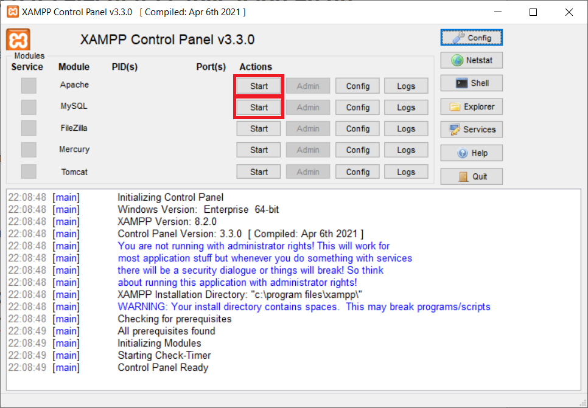
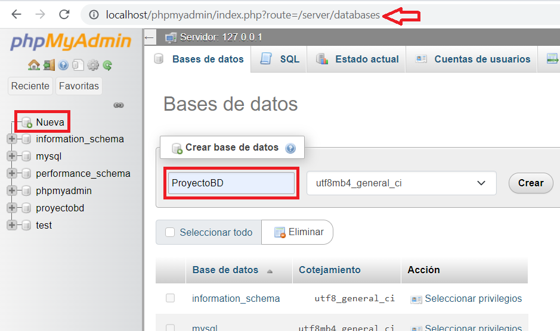
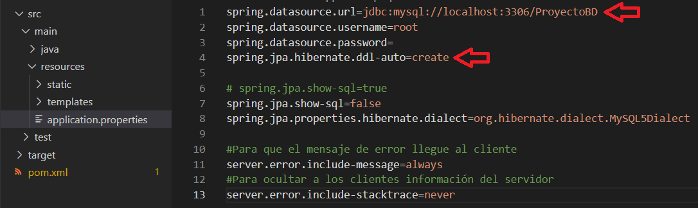
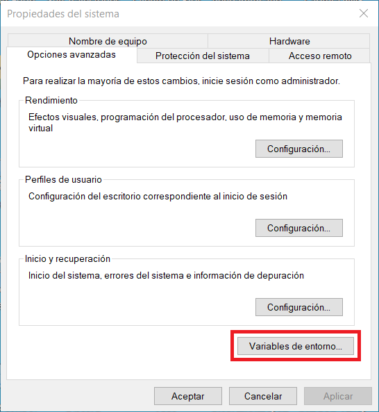
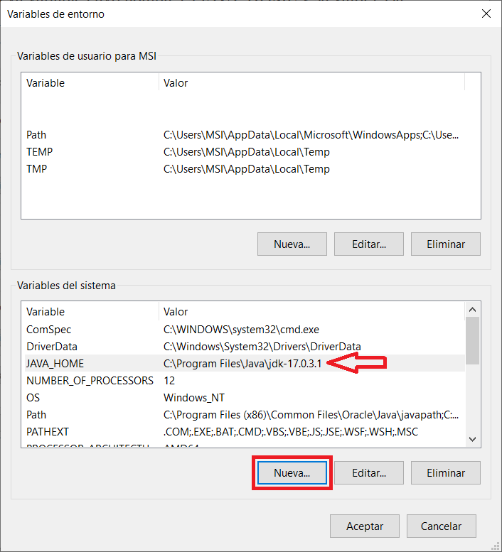
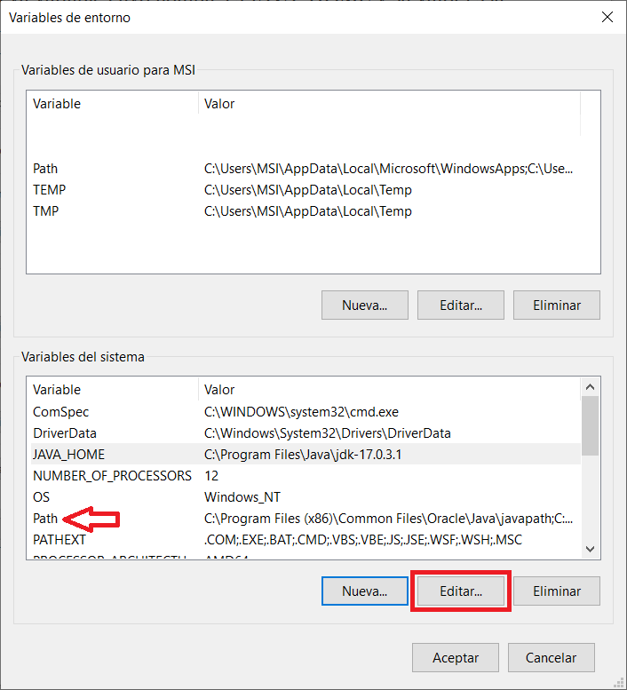
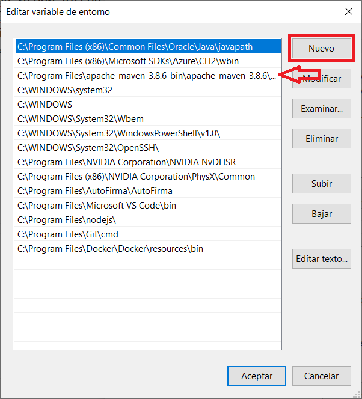

# palabras-encadenadas

palabras-encadenadas es una aplicación web. Dicha aplicación permite a usuarios autentificados crear listas de palabras con kanji de tal forma que una palabra siempre comience con un carácter kanji con el que termina la palabra anterior. Algunos ejemplos de listas válidas son 「大学・学校・校長・長袖」 y 「特大・大人・人体・体操」.

## Instalación

### Node.js

Es necesario tener instalado [Node.js](https://nodejs.org/en/download/package-manager). Yo instalé la versión `v18.16.0`.

Tras la clonación del repositorio en local (`git clone https://github.com/MisakiAnguera/palabras-encadenadas.git`), dentro de la carpeta `/cliente` es necesario instalar npm:

```console
npm install
```

### Base de datos

Para que la base de datos pueda estar en funcionamiento, es necesario instalar [XAMPP](https://www.apachefriends.org/download). Yo instalé la versión `8.2.0`. En el Control Panel v3.3.0 de XAMPP es necesario iniciar tanto Apache como MySQL.



Se crea una base de datos cuyo nombre coincida con el indicado en el archivo `/servidor/src/main/resources/application.properties` del proyecto del servidor, al final del valor del parámetro `spring.datasource.url`:




Tras la primera ejecución del proyecto del servidor, el valor del parámetro `spring.jpa.hibernate.ddl-auto` del mismo archivo `application.properties` debe ser cambiado de `create` a `validate` para no perder los datos guardados en la base de datos.

### Java

Para ejecutar el servidor, es necesario el JDK 17. Yo instalé la versión `17.0.3.1`. En Windows, se abre “Editar las variables de entorno del sistema”. En sus opciones avanzadas, en el apartado “Variables de entorno”, en el recuadro “Variables del sistema”, se añade una nueva variable cuyo nombre es `JAVA_HOME` y su valor es la ruta a dicho JDK previamente descargado y descomprimido.




### Maven

Es necesario tener [Maven](https://maven.apache.org/download.cgi) descargado. Yo descargué la versión `3.8.6`. Se modifica la variable del sistema “Path”, similar a la del JDK previo, de forma que se añade una nueva ruta al “Path” con la ruta al directorio de Maven.




Se instala Maven mediante la ejecución del siguiente comando desde el directorio raíz del proyecto de Java, en la carpeta `/servidor`:

```console
mvn clean install
```

## Ejecución

### Cliente

Se ejecuta el siguiente comando desde el directorio raíz del proyecto de Next.js, en la carpta `/cliente`:

```console
npm run dev
```

Se puede abrir la ruta [localhost:3000](http://localhost:3000)

### Servidor

Se ejecuta el siguiente comando desde el directorio raíz del proyecto de Java, en la carpeta `/servidor`:

```console
mvn spring-boot:run
```

Aunque se ha mencionado previamente, se recuerda que tras la primera ejecución del proyecto del servidor, el valor del parámetro `spring.jpa.hibernate.ddl-auto` del archivo `/servidor/src/main/resources/application.properties` debe ser cambiado de `create` a `validate` para no perder los datos guardados en la base de datos. Por otra parte, será necesario comentar las líneas de código correspondientes al interior del método `metodo` del archivo `/servidor/src/main/java/com.example.proyecto/ProyectoApplication.java` para que no los vuelva a crear:

```java
	@Bean
	public CommandLineRunner metodo(UsuarioService usuarioService, ListaService listaService) {
		return args -> {
			// usuarioService.anadir(new Usuario("admin@admin.admin", "Admin", "contraseña 1",
			// 		LocalDate.of(1970, 1, 1), Rol.ADMINISTRADOR));
			// usuarioService.anadir(new Usuario("admin2@admin.admin", "Admin", "contraseña 2",
			// 		LocalDate.of(1970, 1, 1), Rol.ADMINISTRADOR));
			// usuarioService.anadir(new Usuario("admin3@admin.admin", "Admin", "contraseña 3",
			// 		LocalDate.of(1970, 1, 1), Rol.ADMINISTRADOR));
		};
	}
```